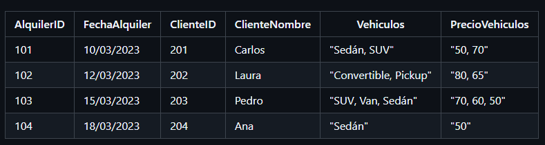

# Ejercicio 3

En una base de datos de una empresa de alquiler de vehículos, se tiene la siguiente tabla Alquileres que contiene información sobre los vehículos alquilados y sus conductores.

Normaliza la tabla Alquileres para que cumpla con 1FN, 2FN y 3FN. Identifica las dependencias funcionales y elimina las dependencias parciales y transitivas en cada paso.

## Dependencias funcionales:

+ AlquilerID → FechaAlquiler, ClienteID, ClienteNombre, Vehiculos, PrecioVehiculos
  
+ ClienteID → Clientenombre
  
+ Vehiculos → PrecioVehiculos

## Primera forma Normal (1FN)

Para que la tabla esté en 1FN, todos los valores deben ser atómicos, es decir, no debe haber listas o conjuntos de valores en un solo campo. En este caso, la tabla __vehiculos__ no está atomizada.

+ Nueva Tabla __Alquileres__:
  
|AlquilerID|FechaAlquiler|ClienteID|Vehiculo|
|-----|-----|------|-----|
| 101 | 10/03/2023 | 201 |Sedán|
| 101 | 10/03/2023 | 201 |SUV|
| 102 | 12/03/2023 | 202 |Convertible|
| 102 | 12/03/2023 | 202 |Pickup|
| 103 | 15/03/2023 | 203 |SUV|
| 103 | 15/03/2023 | 203 |Van|
| 103 | 15/03/2023 | 203 |Sedán|
| 104 | 18/03/2023 | 204 |Sedán|

## Segunda forma normal (2FN)

Eliminar dependencias parciales. 

En este caso, __ClienteNombre__ depende de __ClienteID__ y __PrecioVehiculos__ depende de __Vehiculos__.

+ Nueva tabla __Clientes__:

|ClienteID|ClienteNombre|
|---------|-------------|
|201|Carlos|
|202|Laura|
|203|Pedro|
|204|Ana|

+ Nueva tabla __Vehiculos__:

|VehiculoID|Vehiculo|Precio|
|---------|-------------|------|
|1|Sedán|50|
|2|Suv|70|
|3|Convertible|80|
|4|Pickup|65|
|5|Van|60|

## Tercera Forma Normal (3FN)

La tabla debe estar en 2FN y no debe haber dependencias transitivas. Un atributo no clave no debe depender de otro atributo no clave.

__Dependencias transitivas eliminadas:__ Ya no hay dependencias transitivas en la estructura actual. ClienteNombre está en una tabla separada (Clientes), y Precio está en la tabla Vehiculos.

+ Nueva tabla Alquileres final:

|AlquilerID|FechaAlquiler|ClienteID|Vehiculo|
|-----|-----|------|-----|
| 101 | 10/03/2023 | 201 |1|
| 101 | 10/03/2023 | 201 |2|
| 102 | 12/03/2023 | 202 |3|
| 102 | 12/03/2023 | 202 |4|
| 103 | 15/03/2023 | 203 |2|
| 103 | 15/03/2023 | 203 |5|
| 103 | 15/03/2023 | 203 |1|
| 104 | 18/03/2023 | 204 |1|