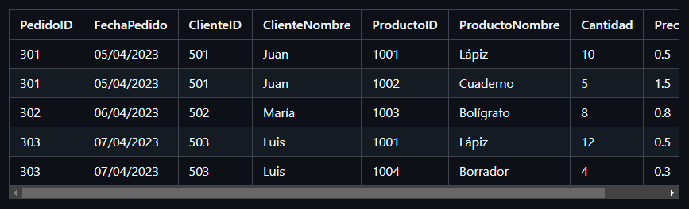

# Ejercicio 4

Una tienda de suministros almacena los datos de sus pedidos en la siguiente tabla Pedidos.

Normaliza la tabla Pedidos para que cumpla con 1FN, 2FN y 3FN. Identifica las dependencias funcionales y elimina las dependencias parciales y transitivas en cada paso.

## Dependencias funcionales

+ PedidoID → FechaPedido, ClienteID, ProductoID, Cantidad, PrecioUnitario

+ ClienteID → ClienteNombre

+ ProductoID → ProductoNombre, PrecioUnitario

## Primera Forma Normal (1FN)

La tabla ya está en 1FN, pues todos los valores son atómicos.

## Segunda Forma Normal (2FN)

Eliminar dependencias parciales. En este caso:

ClienteNombre depende de ClienteID.

ProductoNombre y PrecioUnitario dependen de ProductoID.

+ Nueva tabla __Clientes__:

|ClienteID|ClienteNombre|
|---------|-------------|
|501|Juan|
|502|María|
|503|Luis|

+ Nueva tabla __Productos__:

|ProductoID|ProductoNombre|PrecioUnitario|
|----------|--------------|--------------|
|1001|Lápiz|0.5|
|1002|Cuaderno|1.5|
|1003|Bolígrafo|0.8|
|1004|Borrador|0.3|

## Tercera Forma Normal (3FN)

Dependencias transitivas eliminadas: Las tablas Clientes y Productos eliminan las dependencias transitivas, ya que los atributos ClienteNombre, ProductoNombre y PrecioUnitario están en sus propias tablas.

+ Nueva tabla __Pedidos__ final:

|PedidoID|FechaPedido|ClienteID|ProductoID|Cantidad|
|----------|--------|-------|-----|-----|
|301|05/04/2023|501|1001|10|
|301|05/04/2023|501|1002|5|
|302|06/04/2023|502|1003|8|
|303|07/04/2023|503|1001|12|
|303|Borra07/04/2023|503|1004|4|