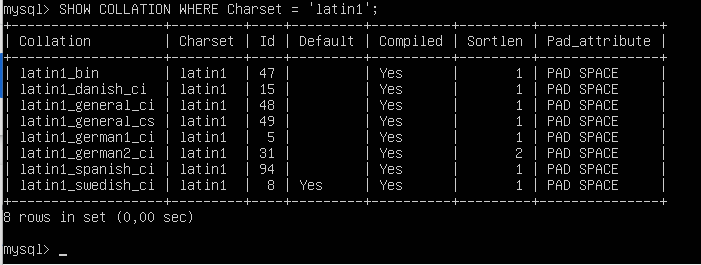
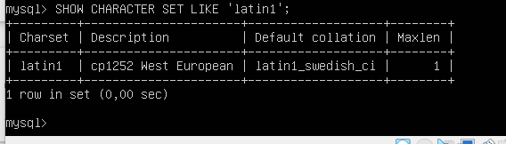

# Ejercicio 2

## Muestra todos los collations disponibles para el conjunto de caracteres latin1. ¿Cuál es el collation predeterminado de latin1?

Nota: hay que generar dos consultas: una por cada pregunta.

## _Comando 1: Mostrar todos los collations disponibles para el conjunto de caracteres_ ___latin1___

```comand
SHOW COLLATION WHERE Charset = 'latin1';
```

### Salida



## _Comando 2: Determinar el collation predeterminado para_ ___latin1___

```comand
SHOW CHARACTER SET LIKE 'latin1';
```

### Salida 2


