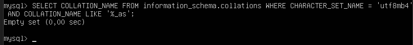
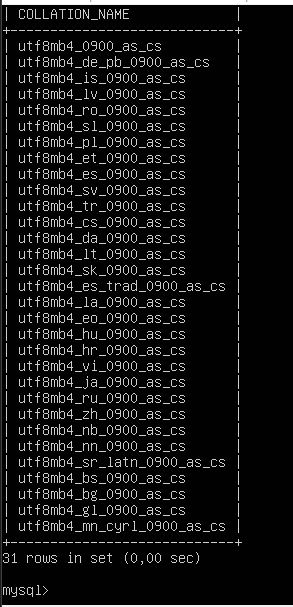

# Ejercicio 3

## Filtra las collations del conjunto utf8mb4 que sean sensibles a acentos (as). Filtra las collations del conjunto utf8mb4 que sean sensibles a mayúsculas (cs)

Nota: hay que generar dos consultas: una por cada pregunta.

## _Comando 1: Filtrar las collations del conjunto utf8mb4 que son sensibles a acentos (as)_

```comand
SELECT COLLATION_NAME FROM information_schema.collations WHERE CHARACTER_SET_NAME = 'utf8mb4' AND COLLATION_NAME LIKE '%_as';
```

### Salida



## _Comando 2: Filtra las collations del conjunto utf8mb4 que son sensibles a mayúsculas (cs)_

```comand
SELECT COLLATION_NAME FROM information_schema.collations WHERE CHARACTER_SET_NAME = 'utf8mb4' AND COLLATION_NAME LIKE '%_cs';
```

### Salida 2


