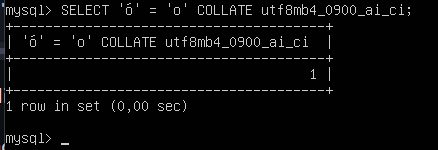
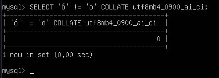

# Ejercicio 4

## Compara si ó es igual a o utilizando el collation utf8mb4_0900_ai_ci. Compara si ó es diferente de o utilizando el collation utf8mb4_0900_as_ci

Nota: hay que generar dos consultas: una por cada pregunta.

## Comando 1: Comparar si 'ó' es igual a 'o' usando el collation utf8mb4_0900_ai_ci

```comand
SELECT 'ó' = 'o' COLLATE utf8mb4_0900_ai_ci;
```

### Salida



- __Conclusión:__ Como ha devuelto 1, significa que la consulta es cierta, 'ó' es igual a 'o'.

## Comando 2: Comparar si 'ó' es diferente de 'o' usando el collation utf8mb4_0900_as_ci

```comand
SELECT 'ó' != 'o' COLLATE utf8mb4_0900_as_ci;
```

### Salida 2



- __Conclusión:__ Como ha devuelto un 0, quiere decir que la consulta es falsa, 'ó' no es diferente a 'o'.
