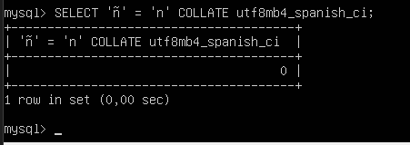
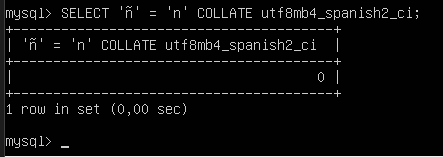

# Ejercicio 5

## Compara si la ñ es igual a n utilizando los collations utf8mb4_spanish_ci y utf8mb4_spanish2_ci

## _Comando 1: Usando el collation utf8mb4_spanish_ci_

```comand
SELECT 'ñ' = 'n' COLLATE utf8mb4_spanish_ci;
```

### Salida



- Conclusión: La consulta es falsa, la 'ñ' no es igual a la 'n' en el collation utf8mb4_spanish_ci

## _Comando 2: Usando el collation utf8mb4_spanish2_ci_

```comand
SELECT 'ñ' = 'n' COLLATE utf8mb4_spanish2_ci;
```

### Salida 2



- Conclusión: La consulta es falsa, la 'ñ' no es igual a la 'n' en el collation utf8mb4_spanish2_ci
