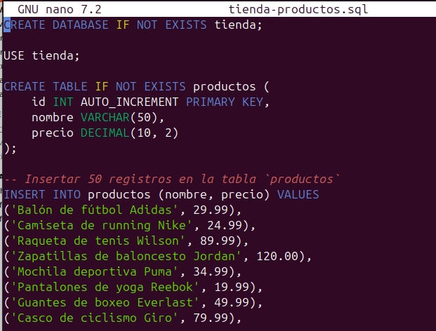
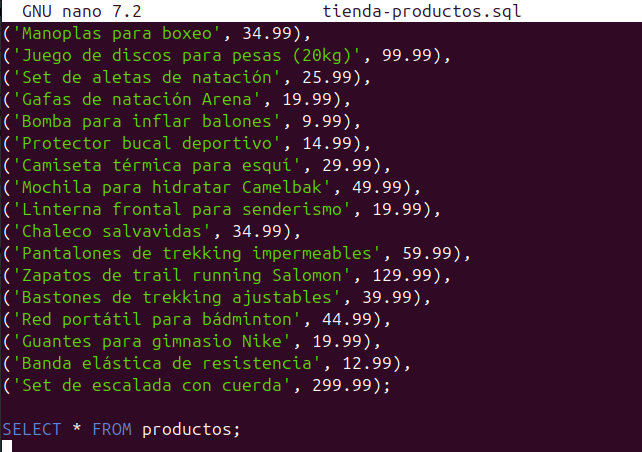
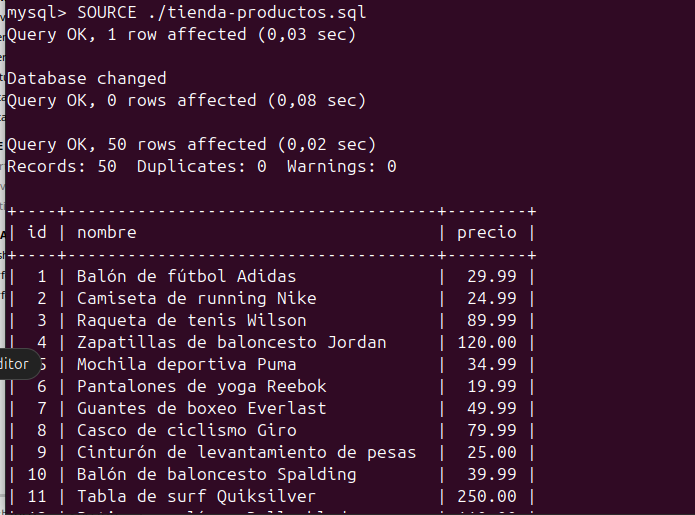
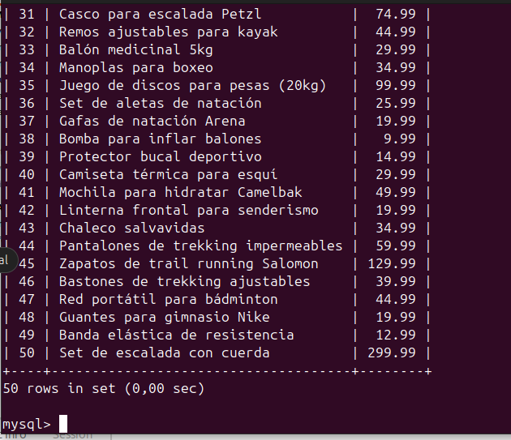

# Cargar el siguiente fichero tienda-productos.sql en Base de Datos. Para ello utiliza el comando SOURCE con rutas relativas

## Imagen 1 y 2: archivo tienda-productos.sql

## Imagen 1 y 2: Cargar el fichero 'tienda-productos.sql' en la base de datos con SOURCE

