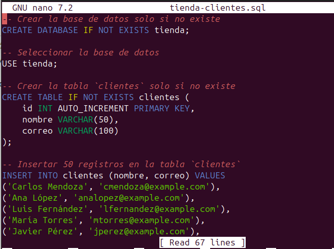
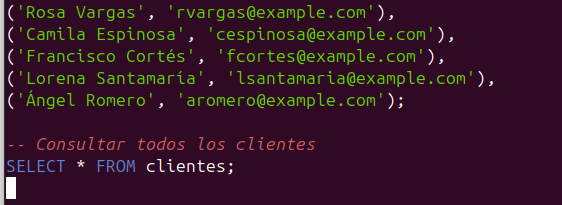
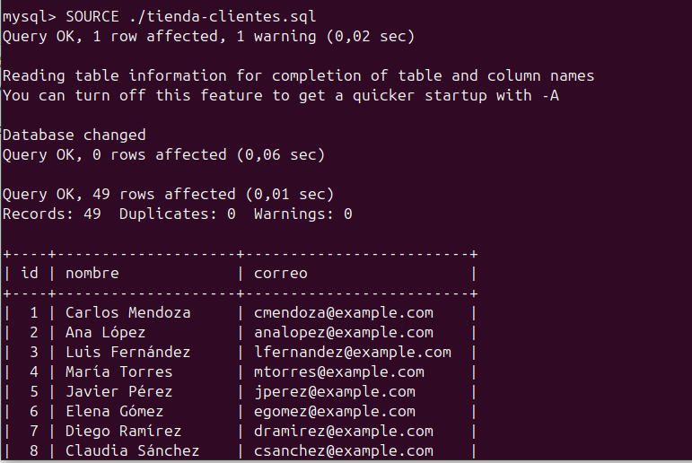
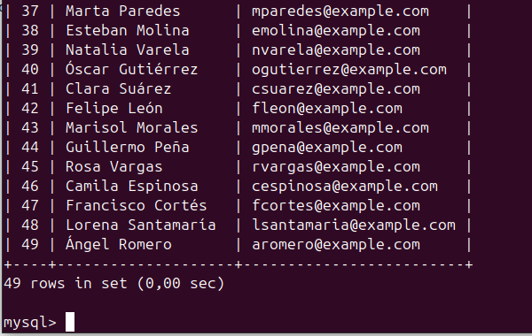

# Cargar el siguiente fichero tienda-clientes.sql en Base de Datos. Para ello utiliza el comando SOURCE con rutas absolutas

## Imagen 1 y 2: archivo tienda-clientes.sql

## Imagen 3 y 4: Cargando el fichero 'tienda-clientes.sql' en la base de datos con el comando SOURCE

